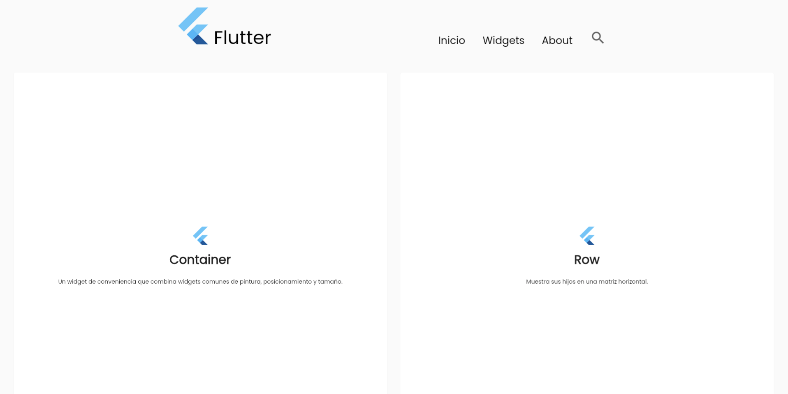
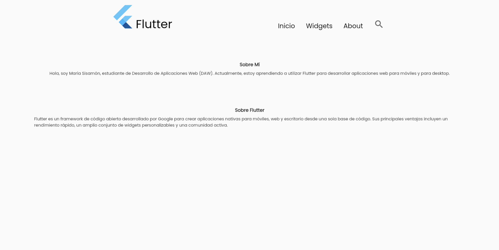

# Flutter Project 01 - SisamonMarquezD01

This Flutter project aims to **create a replica** following the given instructions. The main objectives are as follows:

### Project Structure

- **Folder Organization:** Widgets are organized into separate folders for better code structure and maintainability.
- **Avoid Infinite Widget Trees:** Care has been taken to avoid creating an infinite tree of widgets.

### Widgets Exploration

Additional widgets not covered in class have been incorporated, and their usage has been researched on the [official Flutter documentation](https://docs.flutter.dev/):

- [FlutterLogo](https://api.flutter.dev/flutter/material/FlutterLogo-class.html)
- [Icon](https://api.flutter.dev/flutter/widgets/Icon-class.html)

### Navigation

The navigation bar consists of three sections:

1. **Home** (Inicio): The default landing page.
2. **Widgets**: Navigates to a page displaying a grid of cards with data fetched from a **JSON** file.
3. **About**: Provides a brief overview of the project creator and information about Flutter.

### Screens

#### Screen 1: Inicio - Navigation with Components

- **Description:** The first screen includes a navigation bar and two components.
- **Components:**
  - Text
  - Button

#### Screen 2: Inicio - Counter with Buttons

- **Description:** The second screen features a counter accompanied by three buttons.
- **How it works:**
  - It starts counting from zero
  - It doesn't display negative numbers		

#### Screen 3: Widgets - Cards and JSON file

- **Description:** The third screen shows the nav and a series of cards.
- **Cards:**
  - They are arranged as a two-column grid
  - The data is obtained from a JSON file located in the assets folder		
  - Each card has:
    - Flutter Icon
    - Name
    - Description

#### Screen 4: About - Section with information

- **Description:** The fourth screen shows the nav and information about the project.
- **Features:**
  - Nav
  - Text with title in bold and description		

