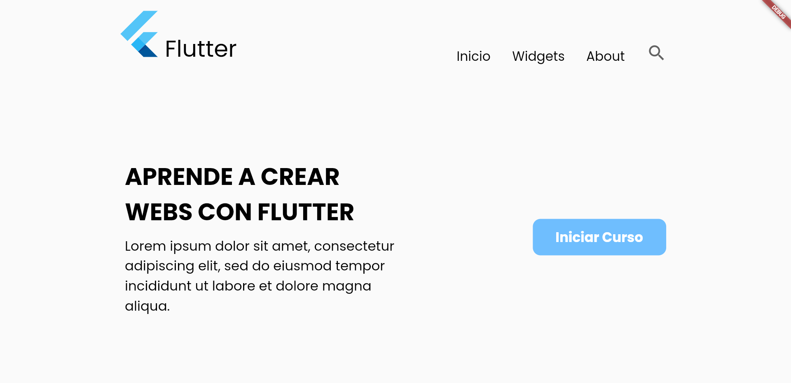
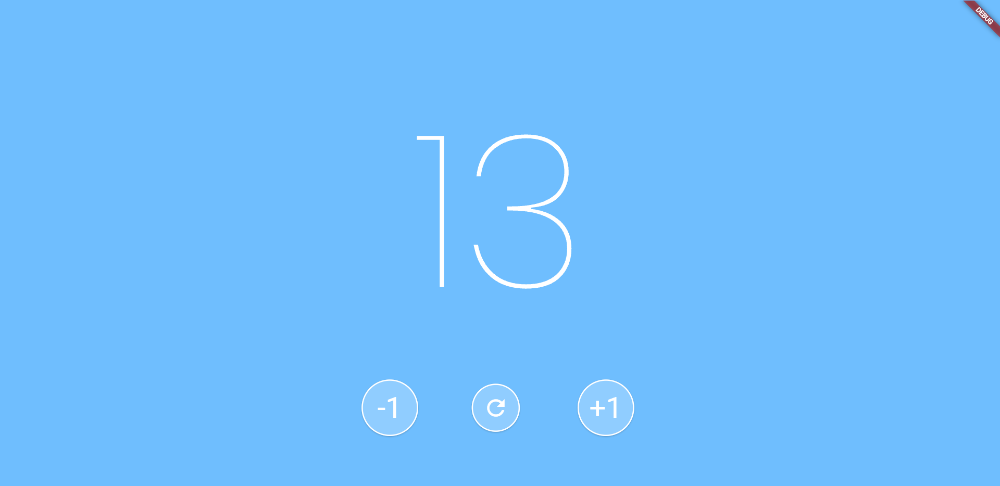

# Flutter Project 01 - SisamonMarquezD01

This Flutter project aims to **create a replica** following the given instructions. The main objectives are as follows:

### Project Structure

- **Folder Organization:** Widgets are organized into separate folders for better code structure and maintainability.
- **Avoid Infinite Widget Trees:** Care has been taken to avoid creating an infinite tree of widgets.

### Widgets Exploration

Additional widgets not covered in class have been incorporated, and their usage has been researched on the [official Flutter documentation](https://docs.flutter.dev/):

- [FlutterLogo](https://api.flutter.dev/flutter/material/FlutterLogo-class.html)
- [Icon](https://api.flutter.dev/flutter/widgets/Icon-class.html)

### Screens

#### Screen 1: Navigation with Components

- **Description:** The first screen includes a navigation bar and two components.
- **Components:**
  - Text
  - Button

#### Screen 2: Counter with Buttons

- **Description:** The second screen features a counter accompanied by three buttons.

